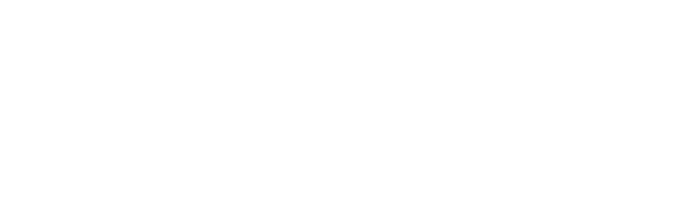

# FAITH LIGHT

Pilih karaktermu dan tentukan jalan ceritanya di Faith Light 
permainan website berbasis teks yang sangat sederhana.

# **WARNING**
>*"Demi kenyamanan bermain FAITH LIGHT belum mendukung tampilan di desktop,laptop,tab landscape,notebook,TV.harap gunakan smartphone/mobile phone"*
# Tentang Faith Light
Faith Light adalah permainan adventure sederhana berbasis teks yang dapat 
dimainkan di browser kapanpun dan dimanpun.Faith light berfokus
pada jalan cerita karaktermu setiap kalimat yang kamu pilih akan menentukan nasib dari karaktermu.

# Dibangun Dengan
- [HTML](https://id.m.wikipedia.org/wiki/HTML)
- [CSS](https://id.m.wikipedia.org/wiki/Cascading_Style_Sheets)
- [BOOTSTRAP](https://id.m.wikipedia.org/wiki/Bootstrap_(kerangka_kerja))
- [JAVASRCIPT](https://id.m.wikipedia.org/wiki/JavaScript)

# Memulai
**Prasyarat**
1. **Disarankan menggunakan mobile phone.**
2. Memiliki akses ke `NETWORK` yang stabil.
3. Disarankan Gunakan browser versi terbaru.

**Start**
1. Masuk halaman homepage FAITH LIGHT/`index.html`.
2. Tidak diperlukan Masuk atau Daftar.
2. Klik **PLAY**.
3. Pilih karaktermu *(beberapa karakter mungkin terkunci untuk pertama kali bermain)*.
4. Klik **PILIH** pada karakter yang kamu inginkan, setiap karakter memiliki kemampuan yang berbeda satu sama lain.
5. Klik **KEMBALI** jika ingin mengganti karakter.
6. Terakhir klik **Selesai dan bermain**.

# Berkontribusi
Kontribusi pengguna adalah inti dari komunitas open source. hal ini yang membuat komunitas open source menjadi tempat yang tepat untuk belajar, dan berkarya. setiap kontribusi yang kamu buat sangat diapresiasi.

# Lisensi
Didistribusikan di bawah Lisensi MIT.

